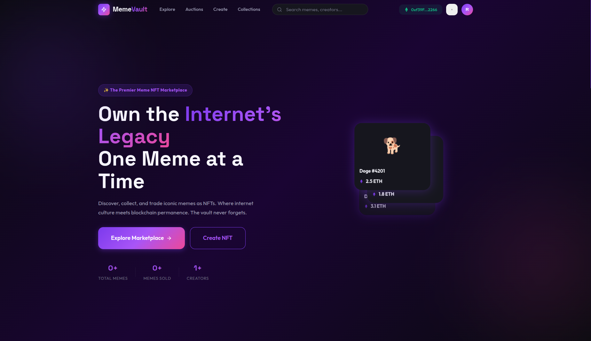
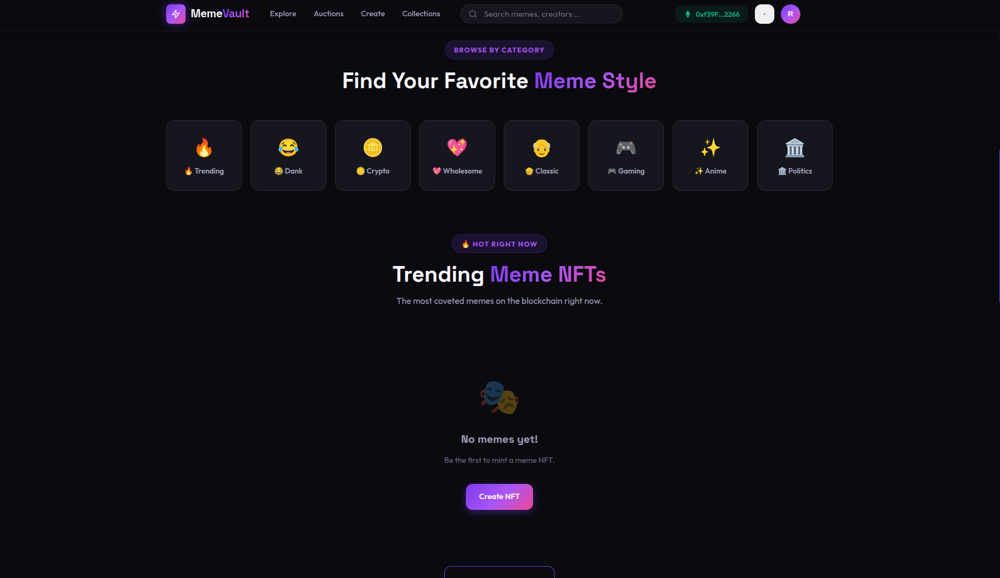
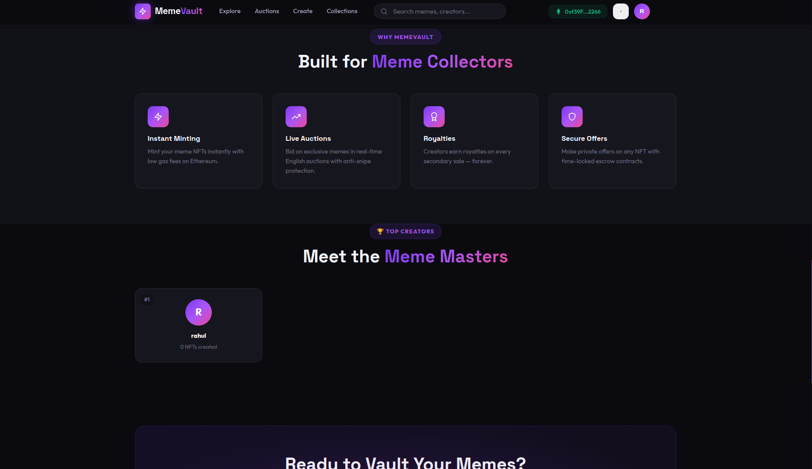
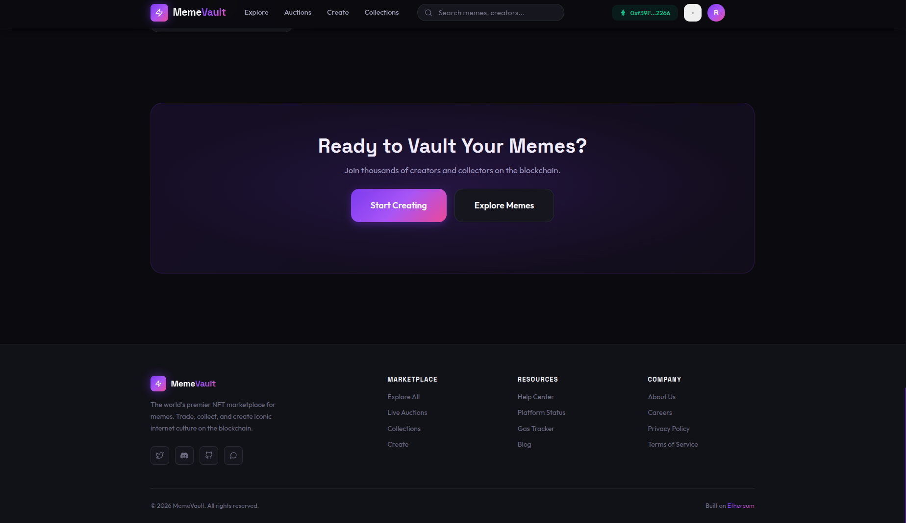
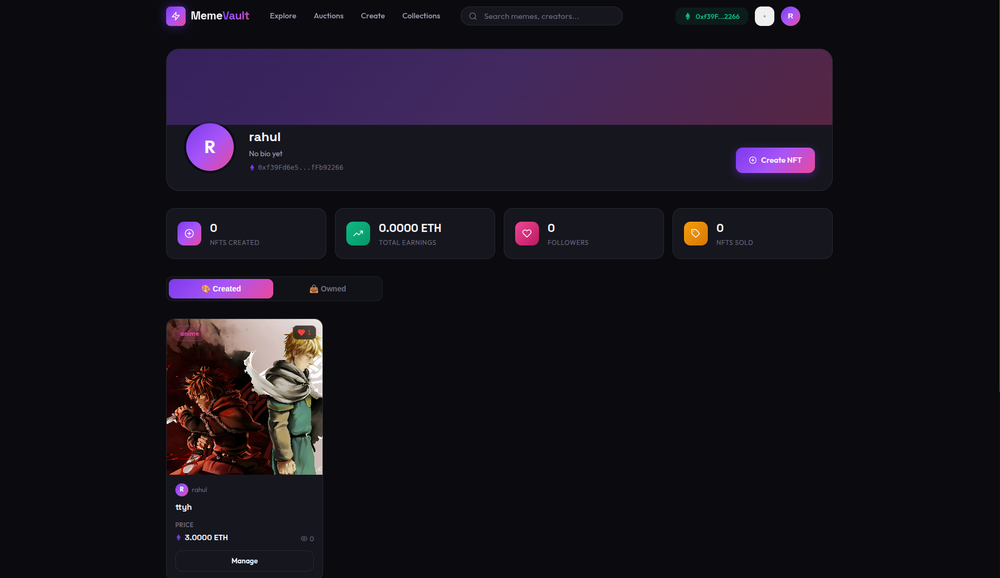
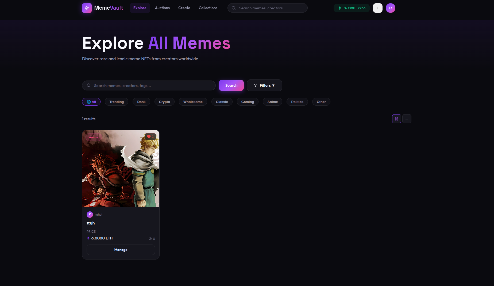
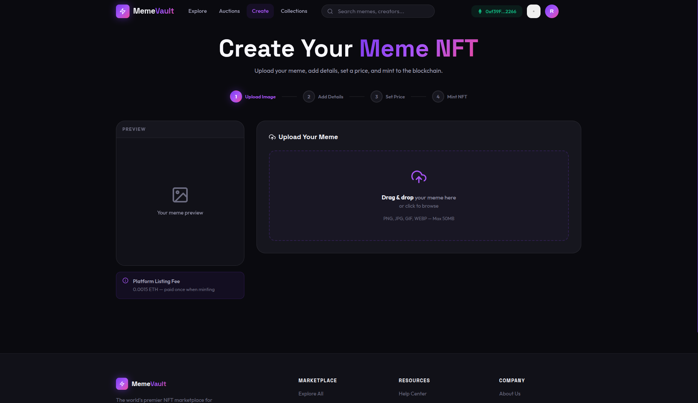
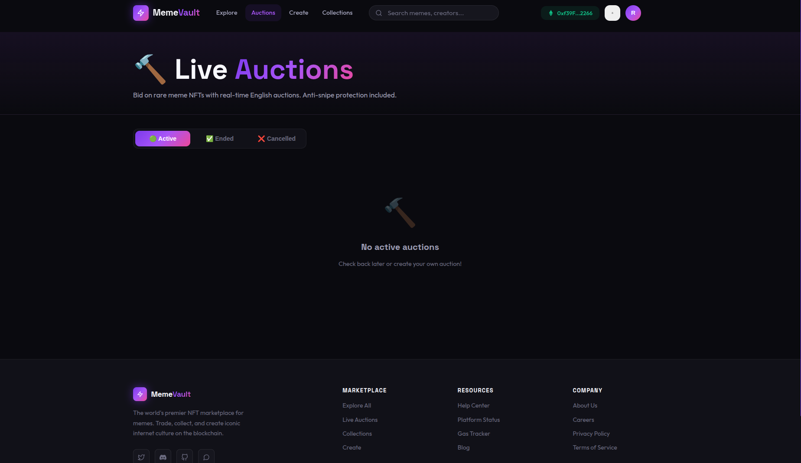

**GitHub Repo URL:** https://github.com/RahulPB08/MEME_VAULT

---

## 1. Chosen Stack
The MemeVault NFT Marketplace is built on a custom **Web3 MERN Stack**. This architecture expands the standard MERN paradigm by integrating decentralized blockchain technologies, creating a highly scalable and robust Web3 distributed application (dApp).

**The complete stack consists of:**
* **Frontend:** React.js, Vite (bundler), Framer Motion (animations), and Ethers.js v6 (for Web3 provider access).
* **Backend:** Node.js, Express.js (REST API framework).
* **Database:** MongoDB (using Mongoose Object Data Modeling).
* **Storage Protocol:** Pinata (IPFS - InterPlanetary File System) for decentralized, immutable image hosting.
* **Blockchain:** Solidity (Smart Contracts), Local Anvil (Ethereum test node), and Foundry (compilation & development toolchain).

---

## 2. User Interface
The User Interface (UI) is designed as a responsive, dark-mode Single Page Application (SPA). It leverages CSS glassmorphism and Framer Motion for premium-feeling micro-animations. It successfully bridges web2 authentication with advanced web3 wallet signing, providing a fluid user experience.

**Key UI Pages Constructed:**
* **Login / Register:** JWT-based authentication workflows with animated UI toggles.
* **Home Page:** Landing screen featuring hero banners, trending memes, category filters, and platform features.
* **Explore Page:** An advanced marketplace grid to browse all minted meme NFTs, supporting search queries and status filters.
* **Create Wizard:** A multi-step animated form allowing users to select an image, interact with Pinata IPFS, set metadata (royalties, price), and mint the asset to the blockchain.
* **NFT Detail Page:** Deep-dive view of individual NFTs showing chain history, live offers, and instantaneous "Buy" functionality.
* **Auctions View:** Dedicated interface for real-time English auctions tracking the highest bidder and countdown timers.
* **Dashboard / Profile:** Private and public spaces for users to track their total earnings, collection stats, created NFTs, and followers.

### Application Screenshots:

{width=80%}

{width=80%}

{width=80%}

{width=80%}

{width=80%}

{width=80%}

{width=80%}

{width=80%}

---

## 3. Backend Logic
The backend service routes complex off-chain logic, significantly reducing gas costs and RPC (Remote Procedure Call) spam that would occur if the frontend solely relied on the blockchain for queries. 

**Key Backend Logic Segments:**
* **Authentication Service (`/api/auth`):** Uses JSON Web Tokens (JWT) and `bcrypt` for secure hashing. It provides clients with short-lived access tokens stored in LocalStorage to access protected REST routes.
* **Decentralized Storage Abstraction (`/api/upload`):** For NFT creation, raw images are captured via `multipart/form-data` using the `multer` middleware. The backend temporarily buffers the files and streams them securely via API keys to Pinata's decentralized IPFS network, returning an immutable CID hash mapped to the NFT metadata URI.
* **Caching Layer (`/api/nfts`, `/api/auctions`):** Functions as an accelerated caching layer serving the marketplace grid. Off-chain MongoDB syncing allows instantaneous sorting and filtering without querying the smart contract directly.
* **Follower System (`/api/users/follow`):** Implements a relational networking feature allowing creators to gather followers and build an audience natively within the platform.

---

## 4. Database
Our NoSQL Database is tightly coupled with the application's states. Using Mongoose ODM, it bridges generic data (like bios) and indices of blockchain events ensuring lightning-fast lookup times.

**Primary Database Schemas:**

| Schema/Model | Application Layer Scope | Key Database Fields |
| :--- | :--- | :--- |
| **User** | Off-chain auth, networking, wallet associations | `username`, `email`, `password`, `walletAddress`, `followers`, `bio`, `nftsCreated` |
| **NFT** | Secondary indexing of minted blockchain NFTs | `name`, `creator`, `price`, `tokenId`, `royaltyPercent`, `category`, `image` |
| **Auction** | Live auction caching & state mapping | `seller`, `startingPrice`, `highestBidder`, `endTime`, `isActive` |
| **Offer** | Off-market asynchronous bidding states | `buyer`, `amount`, `expirationTime`, `status` |

---

## 5. Integration Workflow
The final piece of the architecture is the **Integration** phase, which securely binds the React components, Express API, MongoDB, and Ethereum ecosystem into a cohesive unit.

**1. Authentication Integration:**
Standard `POST /api/auth/login` requests set the MongoDB user context. Concurrently, a custom `Web3Context` actively listens to the `window.ethereum` object injection from MetaMask to detect the active Web3 account (`0x...`). The application pairs the JWT session with the actively connected wallet.

**2. Smart Contract Transacting:**
When a user initiates the minting process, the integration flow is:
1. React uploads the image to the Backend using `axios`. 
2. The Backend proxies the image to IPFS and returns the generated Metadata URI.
3. React passes the URI into an `ethers.BrowserProvider` execution function targeting `MemeVault.sol`.
4. MetaMask requests user signature.
5. The transaction is validated natively by the EVM and mined. Both the user's dashboard and the database immediately reflect the new token.

**3. Secondary Markets (Auctions & Direct Buys):**
* **Quick Buy:** Clicking "Buy" invokes the payable `buyNFT()` method, directly moving `msg.value` (ETH) from the buyer to the seller, with smart contracts managing state checks (e.g., verifying `msg.value == price`).
* **Auctions Integration:** Real-time English Auctions run strictly on-chain to prevent manipulation. The UI queries block-timestamps against the `endTime` variable set in the `MemeVaultAuction.sol` contract to dynamically render countdowns securely without centralized server reliance.
